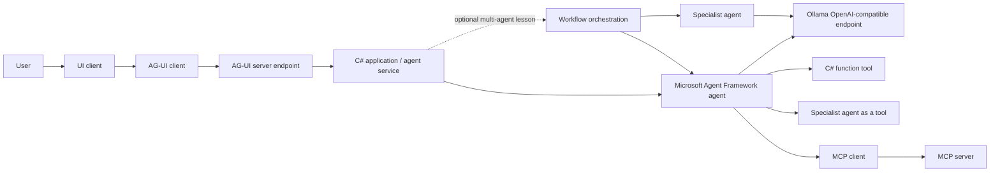
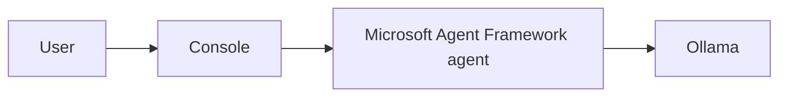

# Hands-on Series: Agent Tools with C#, Ollama, and Microsoft Agent Framework

If we wait for a completed message, we will not know that the model requested a tool until after the message is completed.

So, this requires us to use streaming chat so that we know the model requested a tool and we can provide the result of using the tool to the model before the model finishes its response.  

The use of streaming makes interacting with an agent more natural and makes the overall process more performant.

## New Unified OpenAI Schema API
`POST /v1/responses`

## Request

Full json structure of `/v1/responses` request
```json
{
  "model": "llama3",
  "input": [
    {
      "role": "system",
      "content": "You are a helpful assistant."
    },
    {
      "role": "user",
      "content": "Explain how attention works in transformers."
    }
  ],

  "instructions": "Follow system and developer instructions strictly.",
  "previous_response_id": "resp_000001",

  "tools": [
    {
      "type": "function",
      "function": {
        "name": "search",
        "description": "Search the web for information.",
        "parameters": {
          "type": "object",
          "properties": {
            "query": { "type": "string" }
          },
          "required": ["query"]
        }
      }
    }
  ],

  "tool_choice": "auto",
  "parallel_tool_calls": true,
  "max_tool_calls": 5,

  "temperature": 0.8,
  "top_p": 0.95,
  "top_k": 50,
  "frequency_penalty": 0.2,
  "presence_penalty": 0.1,
  "top_logprobs": 0,

  "max_output_tokens": 500,

  "response_format": {
    "type": "json_schema",
    "json_schema": {
      "name": "transformer_explanation",
      "schema": {
        "type": "object",
        "properties": {
          "summary": { "type": "string" },
          "details": { "type": "string" }
        },
        "required": ["summary"]
      }
    }
  },

  "text": {
    "format": {
      "type": "text"
    }
  },

  "reasoning": {
    "effort": "medium"
  },

  "metadata": {
    "request_id": "req_12345",
    "course": "CS-5010",
    "module": "Transformers"
  },

  "store": true,
  "background": false,
  "service_tier": "default",

  "truncation": "auto",

  "client": {
    "agent": "ECU-Teaching-Agent",
    "version": "1.0.0"
  }

```

---

## ✅ **Brief Description of Every Field in a `/v1/responses` Request**

### **model**  
Name of the model that will generate the response.

### **input**  
Array of messages (system, user, assistant) that form the prompt.

### **instructions**  
Additional high‑level instructions that guide the model’s behavior.

### **previous_response_id**  
Links this request to a prior response for continuity or chaining.

---

## 🧰 **Tooling Fields**

### **tools**  
List of tools/functions the model is allowed to call.

### **tool_choice**  
Controls whether the model may call tools (`auto`, `none`, or forced tool).

### **parallel_tool_calls**  
Allows the model to call multiple tools at the same time.

### **max_tool_calls**  
Maximum number of tool calls allowed for this request.

---

## 🔥 **Sampling & Generation Controls**

### **temperature**  
Controls randomness; higher = more creative.

### **top_p**  
Nucleus sampling; restricts sampling to top‑probability tokens.

### **top_k**  
Limits sampling to the top‑K most likely tokens.

### **frequency_penalty**  
Discourages repeating tokens.

### **presence_penalty**  
Discourages repeating topics or concepts.

### **top_logprobs**  
Number of top token log‑probabilities to return.

### **max_output_tokens**  
Hard limit on how many tokens the model may generate.

---

## 🧩 **Output Formatting**

### **response_format**  
Defines structured output (e.g., JSON schema).

### **text.format**  
Controls plain‑text formatting rules.

### **reasoning.effort**  
Hints at how much internal reasoning the model should perform.

---

# 📦 **Metadata & Execution Behavior**

### **metadata**  
User‑defined metadata attached to the request.

### **store**  
Whether the response should be stored for retrieval or memory.

### **background**  
Runs the request in background mode if supported.

### **service_tier**  
Specifies the service tier (`default`, `premium`, etc.).

### **truncation**  
Controls how long inputs are truncated (`auto`, `disabled`, etc.).

### **client**  
Information about the calling application (agent name, version).

---


### Response

Full json structure of `/v1/responses` response

```json
{
    "id": "resp_785215",
    "object": "response",
    "created_at": 1782526966,
    "completed_at": 1782526966,
    "status": "completed",
    "incomplete_details": null,
    "model": "llama3",
    "previous_response_id": null,
    "instructions": null,
    "output": [
        {
            "id": "msg_316879",
            "type": "message",
            "status": "completed",
            "role": "assistant",
            "content": [
                {
                    "type": "output_text",
                    "text": "In Transformers, attention plays a ...",
                    "annotations": [
                    ],
                    "logprobs": [
                    ]
                }
            ]
        }
    ],
    "error": null,
    "tools": [
    ],
    "tool_choice": "auto",
    "truncation": "disabled",
    "parallel_tool_calls": true,
    "text": {
        "format": {
            "type": "text"
        }
    },
    "top_p": 1,
    "presence_penalty": 0,
    "frequency_penalty": 0,
    "top_logprobs": 0,
    "temperature": 1,
    "reasoning": null,
    "usage": {
        "input_tokens": 20,
        "output_tokens": 200,
        "total_tokens": 220,
        "input_tokens_details": {
            "cached_tokens": 0
        },
        "output_tokens_details": {
            "reasoning_tokens": 0
        }
    },
    "max_output_tokens": 200,
    "max_tool_calls": null,
    "store": false,
    "background": false,
    "service_tier": "default",
    "metadata": {
    },
    "safety_identifier": null,
    "prompt_cache_key": null
}
```

## Microsoft Agent Framework 
- A higher level abstraction that simplifies the OpenAI compatible request/response
- It wraps `/v1/responses` inside an agent loop
- It enforces the Extensions.AI abstractions
- It adds agent-level concepts
- It ensures tool calls follow the function-calling spec
- Does not restrict or limit any `/v1/responses` features
- It provides the following on top of OpenAI schema
  - a structured agent loop
  - a tool execution pipeline
  - memory
  - planning
  - orchestration
  - DI integration
  - logging
  - lifecycle management 

You will then build four kinds of tools for a tutor agent:
1. A **function tool** that runs ordinary C# code.
2. An **agent as a tool** that delegates work to a specialist agent.
3. An **MCP tool** discovered from a separate Model Context Protocol server.
4. A **workflow as a tool** with multiple agents participating


## The architecture that we will have followed after completing all hands-on lessons in this series.



The layers have different jobs:

| Layer | Responsibility |
| --- | --- |
| UI client | Presents the tutor experience to the student and renders streaming text, tool activity, and interaction state. |
| AG-UI client | Sends user input and receives agent interaction events using the AG-UI protocol. |
| AG-UI server endpoint | Bridges the UI protocol to your application or agent service, translating agent updates into AG-UI events. |
| Workflow orchestration | Coordinates multiple agents when the lesson needs a multi-agent workflow; simple streaming chat can call a single agent directly. |
| Local Inference<br/>Ollama| Loads and runs the model on local hardware and exposes an OpenAI-compatible API. |
| OpenAI .NET client | Sends chat requests to that API. |
| Microsoft Agent Framework | Adds agent instructions, streaming response types, tool execution, delegation, and other agent behavior. |
| Your application | Validates input, chooses trusted tools, displays updates, handles errors, and enforces policy. |

An agent is not the model alone. The application, framework, model, instructions, tools, and runtime all contribute to the behavior that you observe.

## We will start with a simple streaming chat using Microsoft Agent Framework (MAF)


Confirm that the .NET 10 SDK and Ollama are installed:

```bash
dotnet --version
ollama --version
```

Use the ollama CLI and pick an ollama model that supports Tool calling as well.
```bash
# list downloaded models
ollama list
# check tool calling ability
ollama show <model name>
```

```bash
+  ➜ ollama show llama3.2
  Model
    architecture        llama
    parameters          3.2B
    context length      131072
    embedding length    3072
    quantization        Q4_K_M

  Capabilities
    completion
    tools

  ...
```
---

## Part 1: Streaming chat response hands-on

### Create the streaming project

```bash
# Create solution
dotnet new sln -n StreamingChat
# Create project
dotnet new console -n StreamingTutor -f net10.0
# Add project to solution
dotnet sln StreamingChat.slnx add StreamingTutor 
# Switch to the project root directory
cd StreamingTutor

# Add needed packages to the project
dotnet add package Microsoft.Agents.AI --version 1.13.0
dotnet add package Microsoft.Agents.AI.OpenAI --version 1.13.0
dotnet add package Microsoft.Extensions.AI --version 10.8.0
dotnet add package OpenAI --version 2.12.0
```

### Packages

| Package | Purpose |
| --- | --- |
| `Microsoft.Agents.AI` | Supplies `AIAgent`, agent responses, and streaming agent APIs. |
| `Microsoft.Agents.AI.OpenAI` | Adapts OpenAI chat clients into Agent Framework agents. |
| `Microsoft.Extensions.AI` | Supplies shared AI abstractions and content types used by Agent Framework. |
| `OpenAI` | Supplies `OpenAIClient`, `ChatClient`, and the OpenAI-compatible HTTP client. |

### Required `using` directives

| Namespace | Why it is needed |
| --- | --- |
| `System.ClientModel` | Supplies `ApiKeyCredential`. |
| `Microsoft.Agents.AI` | Supplies `AIAgent`, `AgentResponseUpdate`, and agent extension methods. |
| `OpenAI` | Supplies `OpenAIClient` and `OpenAIClientOptions`. |
| `OpenAI.Chat` | Makes the OpenAI chat-client-to-agent adapter available. |

### Replace `Program.cs`

```csharp
using System.ClientModel;
using Microsoft.Agents.AI;
using OpenAI;
using OpenAI.Chat;

/*  Currently, MAF does not support Foundry Local */
// string endpoint =  "http://127.0.0.1:53535/v1";
// string model = "qwen2.5-0.5b-instruct-general-cpu:4";

/* Ollama config */
string endpoint = "http://127.0.0.1:11434/v1";
string model = "llama3.2";

var openAIClient = new OpenAIClient(
    new ApiKeyCredential("local inference - does not matter"),
    new OpenAIClientOptions
    {
        Endpoint = new Uri(endpoint)
    });

AIAgent tutorAgent = openAIClient
    .GetChatClient(model)
    .AsAIAgent(
        name: "TutorAgent",
        instructions:
            "You are a patient tutor. Explain one idea at a time and use a short example.");

using var cancellation = new CancellationTokenSource();
Console.CancelKeyPress += (_, eventArgs) =>
{
    // Prevent the process from terminating immediately so the async operation
    // can observe cancellation and close cleanly.
    eventArgs.Cancel = true;
    cancellation.Cancel();
};

string prompt = args.Length > 0
    ? string.Join(' ', args)
    : "Explain the difference between a class and an object in C#.";

Console.WriteLine($"Student: {prompt}");
Console.Write("Tutor: ");

try
{
    await foreach (AgentResponseUpdate update in
        tutorAgent.RunStreamingAsync(prompt, cancellationToken: cancellation.Token))
    {
        // An update can contain tool calls, tool results, usage data, or text.
        // Text is the part intended for the student, so print only that here.
        if (!string.IsNullOrEmpty(update.Text))
        {
            Console.Write(update.Text);
        }
    }

    Console.WriteLine();
}
catch (OperationCanceledException) when (cancellation.IsCancellationRequested)
{
    Console.WriteLine("\nThe request was canceled.");
}
catch (HttpRequestException exception)
{
    Console.Error.WriteLine($"\nCould not reach REST inference service: {exception.Message}");
    Environment.ExitCode = 1;
}
catch (Exception exception)
{
    Console.Error.WriteLine($"\nAn unexpected error occurred: {exception.Message}");
    Environment.ExitCode = 1;
}
```

### Run it:

```bash
dotnet run -- "Explain dependency injection with a tutor example."
```

## What to notice

1. `OpenAIClientOptions.Endpoint` redirects the OpenAI client to Ollama local REST inference.
2. `GetChatClient(model)` selects the model.
3. `AsAIAgent` adds the agent identity and instructions.
4. `RunStreamingAsync` returns updates over time.
5. `update.Text` extracts only text content from that update.
6. Cancellation and connection failures are handled separately.

When tools are added, the same stream can include `FunctionCallContent` and `FunctionResultContent`. That is why we are introducing streaming before tools.